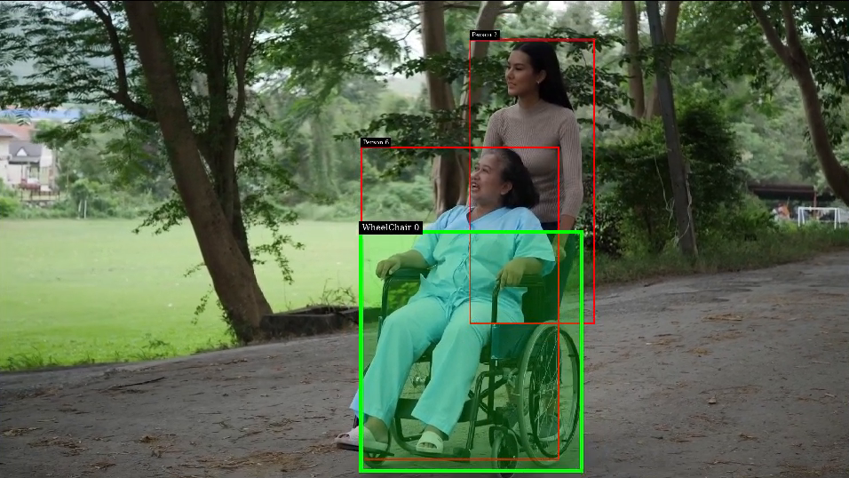

# MobilityAids APP DeepStream
An AI model to identify people who might need mobility assistance.

People who solely depend on mobility aids for their commute could possibly end up
in scenarious where their aid might fail and leave them in uncertain situations. This app could be helpful in addressing such situations.

The app is powered by Intelligent Video Analytics pipeline, Deepstream and Jetson Xavier NX Module


## Prequisites

### 1. Setting Up Deepstream

Make sure that your Jetson device is fully setup, If not check [here](https://docs.nvidia.com/jetson/jetpack/install-jetpack/index.html).

Download the DeepStream 5.0.1 Jetson Debian package `deepstream-5.0_5.0.1-1_arm64.deb`, to the Jetson device from [here](https://developer.nvidia.com/assets/Deepstream/5.0/ga/secure/deepstream_sdk_5.0.1_amd64.deb). Then enter the command:

```bash
sudo apt-get install ./deepstream-5.0_5.0.1-1_arm64.deb
```

#### 2. System Wide Dependencies

To install the following packages, execute the following command:

```sh
   sudo apt-get install libgstreamer-plugins-base1.0-dev \
   libgstreamer1.0-dev \
   libgstrtspserver-1.0-dev libx11-dev \
   git-lfs
```

## Running the Application:

### 1. Clone the repository

```sh
   git clone https://github.com/ajay-naidu-96/mobilityaids.git
```

### 2. Pull the model files

```sh
   git lfs install
   git lfs pull
```

### 3. Build and Run the app

```sh
   cd mobilityaids

   # To compile
   make clean && make -j$(nproc)

   # To run
   ./sample-test-app <uri1>
   ./sample-test-app file:///home/ubuntu/video1.mp4

```

## Description

This document describes this sample test application.

The sample builds on top of the deepstream-test2 and deepstream-test3 app and demonstrates how to:

* Plug in multiple detectors in the pipeline.
* Use of uri-decodebin to accept any type of input (i.e any gstreamer supported container format)
* App is configured to use a single source, but can be modified by changing num_sources param.
* To set engine path to reduce app start time.

This app currently accpets any type of input stream as input. It performs inferences from the two nvinfer plugin connected sequentially in the pipeline. The primary detector being peoplenet and the secondary detector being the mobility aids detector.

### Model Overview

Currently the user has the option to select two different detectors for the mobility aids detector,
First model with a single class - wheelchair
Second model with classes - wheelchair, crutches, walking_frame.

Model Architecture

The model is based on NVIDIA DetectNet_v2 detector with ResNet18 as a feature extractor. Trained with trafficcamnet as the initital pretrained model.

Input:

RGB Image 960 X 544 X 3 (W x H x C)

Output:

Category labels and bounding-box coordinates for each detected object in the input image.

Model load key: tlt_encode

## App Output




##

## Citation

* [University of Freiburg - Autonomous intelligent systems](http://mobility-aids.informatik.uni-freiburg.de/)
